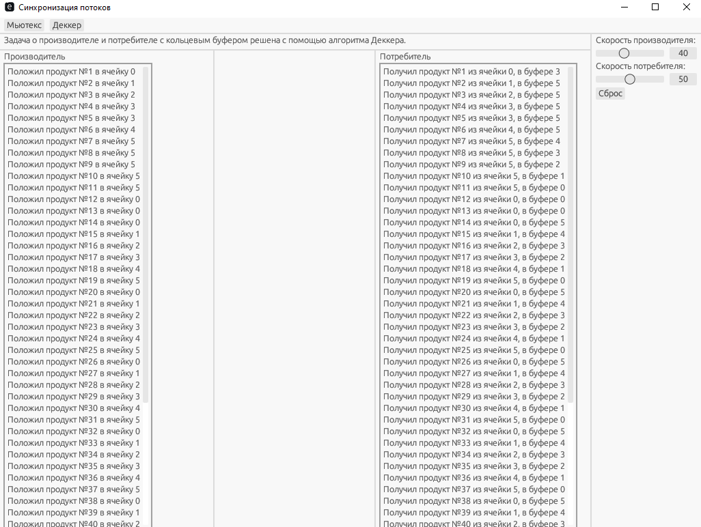
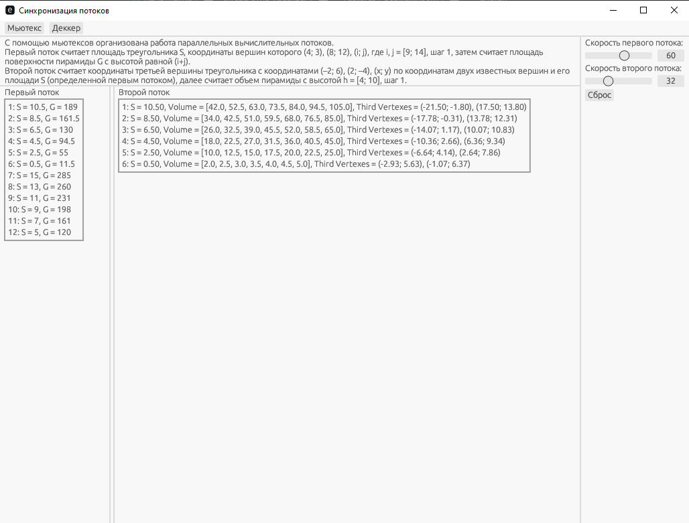

# thread-sync-visualizer
Приложение с графическим интерфейсом, демонстрирующее работу параллельных потоков.

GUI application demonstrating the work of parallel threads. 

## Contents
- [Features](#features--возможности)
- [Usage](#usage--использование)
- [Technologies](#technologies--технологии)
- [License](#license)

## Features / Возможности

### Русский
- Задача о производителе и потребителе с кольцевым буфером решена с помощью алгоритма Деккера
- С помощью мьютексов организована работа двух вычислительных потоков
- Визуализация в GUI
- Регулировка скорости работы потоков через интерфейс
- Перезапуск потоков и очистка состояния

### English
- Producer–Consumer problem with a ring buffer solved using Dekker’s algorithm
- Two computational threads synchronized with mutexes
- GUI visualization of thread activity
- Adjustable thread execution speed through the interface
- Restart of threads and state reset

### On-screen forms / Экранные формы



## Usage / Использование

### Русский
1. Установите [Rust](https://www.rust-lang.org/tools/install)  
2. Клонируйте репозиторий  
3. Соберите проект
4. Запустите приложение

### English
1. Install [Rust](https://www.rust-lang.org/tools/install)  
2. Clone the repository  
3. Build the project 
4. Run the application:

```bash
git clone https://github.com/tanatolog/thread-sync-visualizer.git
cd demo_parallel
cargo build --release
cargo run
```

## Technologies / Технологии
- Rust 1.85.0 
- eframe (egui) 0.23.0
- std::sync (Mutex, Arc, Condvar)
- std::thread

## License
This project is licensed under the MIT License – see the LICENSE file for details.